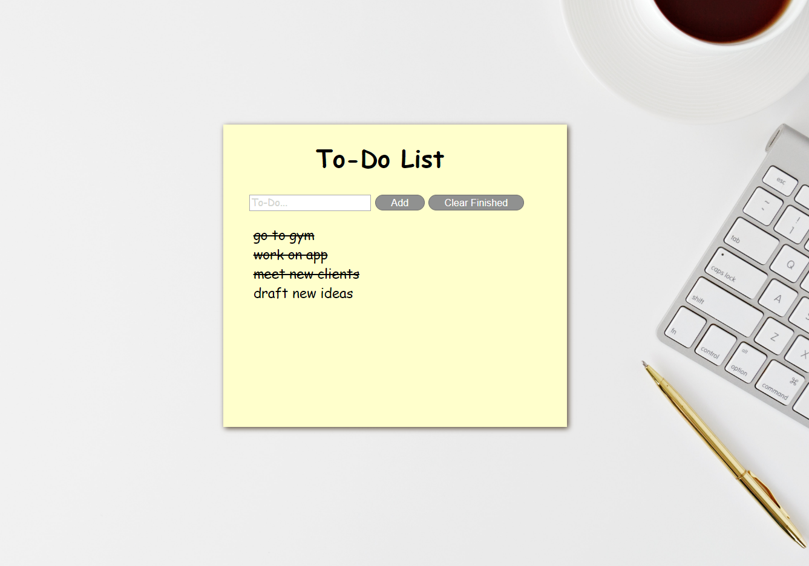

 # To-Do List App

### Use this simple To-Do List App to set goals for the days, weeks or months ahead!

 

 

#  Summary
### This is my To-Do List App project that is built with HTML, CSS and vanilla JS. No Libraries or Frameworks were used. You can add items to complete, cross them off when finished and clear the list when you complete them all.

## Try it out here:    
### [To-Do List App](https://rfussell17.github.io/To-Do/)

## Author
### Robin Fussell
